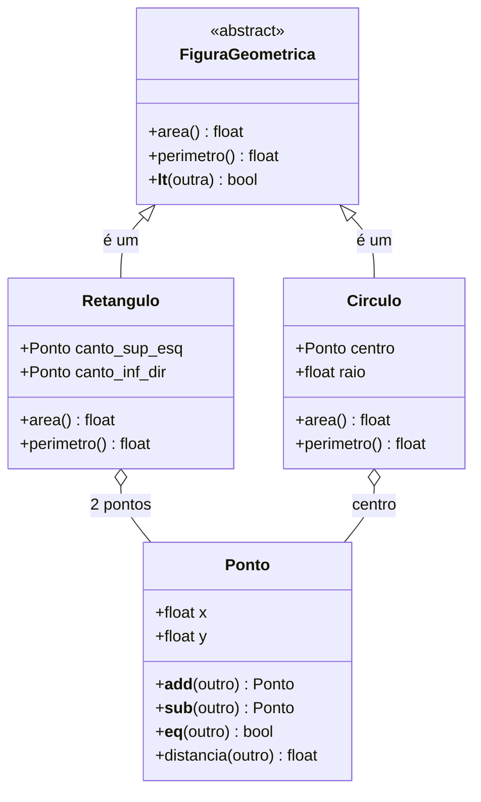

# Diagrama de classes - Figuras geométricas

Legenda UML: `+` público, `#` protegido, `-` privado; `<|--` herança (seta de ponta
aberta da subclasse para a superclasse); `o--` associação/agregação.
